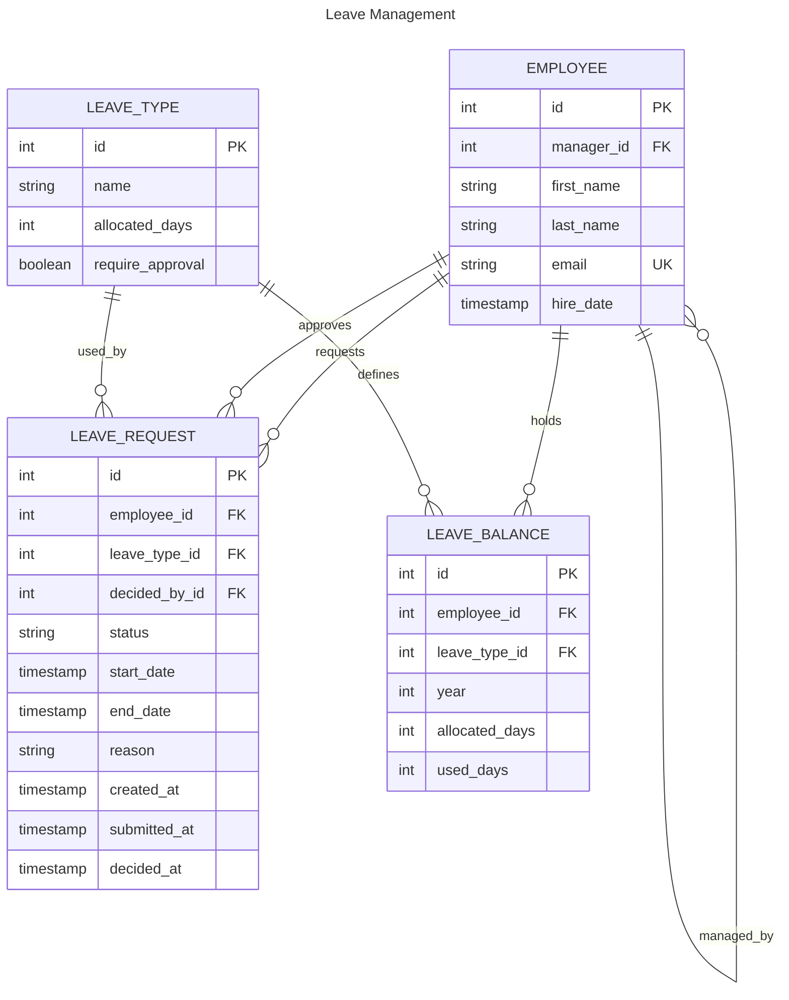

```mermaid
---
title: Leave Management
---
erDiagram
    EMPLOYEE {
        int id PK

        int manager_id FK

        string first_name
        string last_name
        string email UK

        timestamp hire_date
    }
    LEAVE_REQUEST {
        int id PK

        int employee_id FK
        int leave_type_id FK
        int decided_by_id FK

        string status

        timestamp start_date
        timestamp end_date

        string reason

        timestamp created_at
        timestamp submitted_at
        timestamp decided_at
    }
    LEAVE_TYPE {
        int id PK
        string name
        int allocated_days
        boolean require_approval
    }
    LEAVE_BALANCE {
        int id PK

        int employee_id FK
        int leave_type_id FK

        int year

        int allocated_days
        int used_days
    }
    
    EMPLOYEE ||--o{ LEAVE_REQUEST : requests
    EMPLOYEE ||--o{ LEAVE_BALANCE : holds

    EMPLOYEE }o--|| EMPLOYEE : managed_by

    EMPLOYEE ||--o{ LEAVE_REQUEST : approves

    LEAVE_TYPE ||--o{ LEAVE_REQUEST : used_by
    LEAVE_TYPE ||--o{ LEAVE_BALANCE : defines
```
